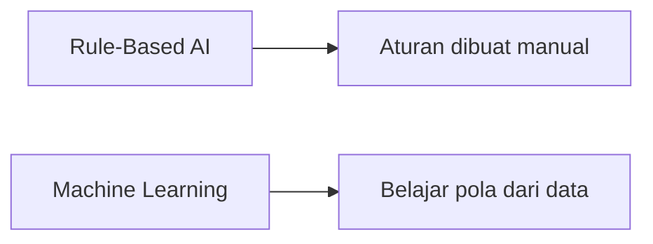

---

## Daftar Isi  
1. [Kecerdasan Buatan (AI)](#artificial-intelligence)  
2. [Pembelajaran Mesin (Machine Learning)](#machine-learning)  
3. [Pembelajaran Mendalam (Deep Learning)](#deep-learning)  
4. [Hubungan dengan Computer Vision](#hubungan-dengan-computer-vision)  

---

## 🤖 Artificial Intelligence

### Definisi dan Konsep Dasar
**Artificial Intelligence (AI)** adalah suatu mekanisme untuk membuat suatu mesin memiliki kemampuan berpikir selayaknya manusia dengan cara mengimplementasikan algoritma-algoritma matematika. 
Persamaan matematis pada AI sering kali mengimplementasikan :
- **Statistika**
- **Probabilitas**
- **Kalkulus**
- **Logika**

### Prinsip Kerja AI
AI hanya bisa memproses data numerik. Apabila terdapat data non-numerik (e.g., teks, gambar, suara), maka diperlukan tahapan untuk melakukan **konversi data ke bentuk numerik** dalam tahap *pre-processing data*

%20versus%20Machine%20Learning%20(ML)%20by%20Nilay%20Parikh%20Medium.png)
)
> **source** : https://blog.nilayparikh.com/the-perennial-debate-of-artificial-intelligence-ai-versus-machine-learning-ml-93b526925318

---

## 📈 Machine Learning

### Definisi dan Konsep Dasar
**Machine Learning** adalah salah satu cabang dari AI yang memungkinkan sistem yang dibuat mampu mempelajari atau menganalisis suatu data tanpa harus diprogram manual oleh manusia. 
Machine Learning lebih berfokus kepada pengembangan sistem untuk membuat model AI yang mampu belajar sendiri dari data yang diterima dan mengoptimisasi performanya tanpa campur tangan manusia. 

### Perbedaan dengan Rule Based AI
**Traditional AI** atau yang sering disebut **Rule-Based AI**adalah sistem yang tersusun atas aturan-aturan atau logika-logika yang dibuat oleh manusia. Sehingga, sistem yang dibuat menjadi kurang fleksibel daripada model Machine Learning

---
## 🧠 Deep Learning

### Definisi dan Konsep Dasar
**Deep Learning** adalah sub-bagian dari Machine Learning dan mengimplementasikan Jaringan Saraf Tiruan/Artificial Neural Network (ANN). ANN adalah algoritma yang terinspirasi dari jaringan saraf di otak manusia. ANN tersusun atas node-node yang menyusun tiap layer dan setiap node dari suatu layer akan terhubung ke node di layer lainnya. . Layer pada ANN terdiri atas :
- **Input Layer** - Lapisan untuk menerima data masukan
- **Hidden Layer** - Lapisan tersembunyi untuk memproses data
- **Output Layer** - Lapisan untuk mengirimkan data yang telah diproses. 

> Komponen Penting pada ANN
- **Weight** - Bobot pada node
- **Bias** - Konstanta pada neural network
- **Fungsi Aktivasi** - ReLU, Sigmoid, Tanh, Linear

> **Note :** Setiap node memiliki nilai *weight* dan *Threshold (Bias)*, ketika output suatu node melebihi nilai *Threshold* maka data output node tersebut akan dikirim menuju node di layer selanjutnya.
