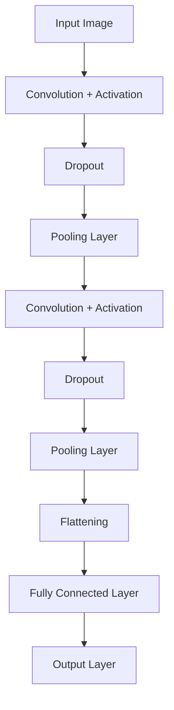

---

## Daftar Isi  
1. [Kecerdasan Buatan (AI)](#artificial-intelligence)  
2. [Pembelajaran Mesin (Machine Learning)](#machine-learning)  
3. [Pembelajaran Mendalam (Deep Learning)](#deep-learning)  
4. [Hubungan dengan Computer Vision](#hubungan-dengan-computer-vision)  

---

> **source** : https://blog.nilayparikh.com/the-perennial-debate-of-artificial-intelligence-ai-versus-machine-learning-ml-93b526925318

## 🤖 Artificial Intelligence

### Definisi dan Konsep Dasar
**Artificial Intelligence (AI)** adalah suatu mekanisme untuk membuat suatu mesin memiliki kemampuan berpikir selayaknya manusia dengan cara mengimplementasikan algoritma-algoritma matematika. 
Persamaan matematis pada AI sering kali mengimplementasikan :
- **Statistika**
- **Probabilitas**
- **Kalkulus**
- **Logika**

### Prinsip Kerja AI
AI hanya bisa memproses data numerik. Apabila terdapat data non-numerik (e.g., teks, gambar, suara), maka diperlukan tahapan untuk melakukan **konversi data ke bentuk numerik** dalam tahap *pre-processing data*

---

## 📈 Machine Learning

### Definisi dan Konsep Dasar
**Machine Learning** adalah salah satu cabang dari AI yang memungkinkan sistem yang dibuat mampu mempelajari atau menganalisis suatu data tanpa harus diprogram manual oleh manusia. 
Machine Learning lebih berfokus kepada pengembangan sistem untuk membuat model AI yang mampu belajar sendiri dari data yang diterima dan mengoptimisasi performanya tanpa campur tangan manusia. 

### Perbedaan dengan Rule Based AI
**Traditional AI** atau yang sering disebut **Rule-Based AI**adalah sistem yang tersusun atas aturan-aturan atau logika-logika yang dibuat oleh manusia. Sehingga, sistem yang dibuat menjadi kurang fleksibel daripada model Machine Learning

---
## 🧠 Deep Learning

> **source** : https://www.spotfire.com/glossary/what-is-a-neural-network

### Definisi dan Konsep Dasar
**Deep Learning** adalah sub-bagian dari Machine Learning dan mengimplementasikan Jaringan Saraf Tiruan/Artificial Neural Network (ANN). ANN adalah algoritma yang terinspirasi dari jaringan saraf di otak manusia. ANN tersusun atas node-node yang menyusun tiap layer dan setiap node dari suatu layer akan terhubung ke node di layer lainnya. . Layer pada ANN terdiri atas :
- **Input Layer** - Lapisan untuk menerima data masukan
- **Hidden Layer** - Lapisan tersembunyi untuk memproses data
- **Output Layer** - Lapisan untuk mengirimkan data yang telah diproses. 

> Komponen Penting pada ANN
- **Weight** - Bobot pada node
- **Bias** - Konstanta pada neural network
- **Fungsi Aktivasi** - ReLU, Sigmoid, Tanh, Linear

> **Note :** Setiap node memiliki nilai *weight* dan *Threshold (Bias)*, ketika output suatu node melebihi nilai *Threshold* maka data output node tersebut akan dikirim menuju node di layer selanjutnya.

---
## 🖼️ Convolutional Neural Network (CNN) dan 👀 Computer Vision (CV)

### Computer Vision (CV)
**Computer Vision** adalah sub-bagian AI yang memungkinkan suatu sistem atau mesin menginterpretasikan data visual sehingga sistem atau mesin tersebut seolah-olah memiliki kemampuan penglihatan. 

Beberapa aplikasi umum Computer Vision antara lain:
- **Image Classification** – mengelompokkan gambar ke dalam kategori tertentu.
- **Object Detection** – mengenali dan menemukan posisi objek dalam gambar.
- **Image Segmentation** – membagi gambar menjadi beberapa bagian atau area.
- **Facial Recognition**
- **OCR (Optical Character Recognition)**
- **Self-driving Cars**, dll.

> **source** : https://www.pycodemates.com/2023/06/introduction-to-convolutional-neural-networks.html

### Convolutional Neural Network (CNN)
**Convolutional Neural Network (CNN)** adalah arsitektur khusus dari Artificial Neural Network (ANN) yang dirancang untuk bekerja dengan data berbentuk grid, seperti gambar (2D grid piksel). CNN sangat efektif dalam mengenali pola visual dan digunakan secara luas dalam bidang pengolahan citra dan video.

### Prinsip Kerja
**Convolutional Neural Network (CNN)** memiliki prinsip kerja yang hampir sama dengan ANN. Dimana, model CNN akan tersusun atas beberapa layer yang bertujuan untuk menerima data input, mengolahnya, dan memberikan output tertentu. Pada CNN, terdapat beberapa layer khusus, yaitu :
- **Convolutional Layer** - Layer tempat komputasi utama model. Pada layer ini, terdapat filter atau kernel yang berfungsi supaya model dapat mengidentifikasi fitur-fitur pada gambar.
- **Pooling Layer** - Layer yang berfungsi untuk mengurangi dimensi data atau memperkecil jumlah pixel pada gambar dengan teknik downsampling. Proses tersebut dapat mengurangi jumlah parameter dan proses komputasi sehigga mengurangi overfitting. Di sisi lain, downsampling dapat memungkinkan loss of information
- **Fully Connected Layer** - Layer yang berperan untuk menentukan keputusan terakhir output model berdasarkan fitur yang telah diolah oleh Convolutional Layer dan Pooling Layer. \
- **Activation Layer** - Layer yang ditambahkan dengan tujuan memberikan sifat non-linear pada model. Sehingga, memungkinkan model mempelajari data yang kompleks.
- **Dropout Layer** - Layer yang memiliki tugas untuk mematikan beberapa neuron pada layer lainnya dengan tujuan untuk mengurangi overfitting pada model.
